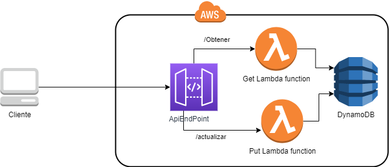

# Actualizacion Datos
Con esta aplicación actualiza tus datos de forma muy fácil. Esta basada en arquitectura serverless, esto quiere decir que los recursos no necesitan tu administración, se crean y se destruyen en minutos cuando tu quieras y pagas solamente por lo que utilizas.

## Pre-rquisitos
- Realizar el despliegue del backend de este repositorio `https://github.com/Sahilyexe/Actualizacion-datos-backend` 
- Copia el valor de del parámetro de Output después de desplegar (`SAM deploy --guided`) "WebEndpoint" en el aechivo "enviroments/enviroment.ts" y guarda
- Ejecutar `npm install`
- Tienes 2 opciones correr el proyecto local
   - Local: 
      - Ejecuta `npm run start`
   - En el la nube  
      - Ejecuta `npm run build --configuration=production --aot=true`
      - Ejecuta para subir al bucket `aws s3 cp ./dist/actualizacion-datos/ s3://<nombre bucket> --recursive`
      - Abre el archivo `index.html`  

## Eliminar la aplicación y los recursos
-  Ejecuta `aws s3 rm s3://<nombre bucket> --recursive` 
- `SAM delete --stack-name actualiza-datos`
